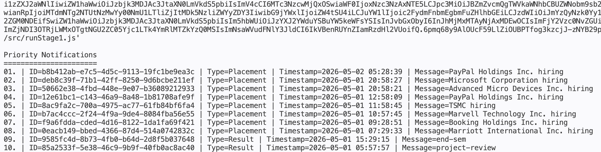

# Stage 1

## Problem
Build a notification prioritization flow that fetches notifications from the evaluation API and returns the top 10 most important unread items. Priority is determined by:

1. Notification type weight: `Placement > Result > Event`
2. Recency within the same type

The API response shown in the prompt does not include a read-state flag, so the current Stage 1 implementation treats all fetched notifications as unread candidates.

## Current Architecture
- `notification_app_be/src/config/evaluation.js`
  Loads the bearer token and API endpoint from runtime configuration.
- `notification_app_be/src/api/notifications.js`
  Fetches notifications from the evaluation API and validates the response shape.
- `notification_app_be/src/service/prioritizeNotifications.js`
  Applies the business ranking rules and returns the top `n` notifications.
- `notification_app_be/src/utils/formatNotifications.js`
  Formats the ranked result into a readable CLI table for verification and screenshots.
- `notification_app_be/src/runStage1.js`
  Composes the flow end to end for execution.
- `logging middleware/`
  Sends mandatory assessment logs to the remote logging API during fetch, validation, ranking, and failure paths.

## Ranking Strategy
Each notification is assigned a static type weight:

- `Placement = 3`
- `Result = 2`
- `Event = 1`

The service sorts by:

1. Descending type weight
2. Descending timestamp

This guarantees that all higher-priority categories appear before lower-priority ones, while still showing the newest entries first inside each category.

## Why This Works
The requirement is not global recency. It is category-priority first, then recency. A plain descending timestamp sort would violate the prompt because a recent `Event` could incorrectly outrank an older `Placement`. The weighted sort enforces the required business rule directly.

## Efficient Top 10 Maintenance
The current implementation sorts the fetched list and slices the first 10 results. That is simple and correct for the current API size.

If notifications continue streaming in for a long-running service, the top 10 can be maintained more efficiently with a bounded min-heap of size 10:

1. Convert each notification into a comparable priority key `(weight, timestamp)`.
2. Push items into the heap until it reaches size 10.
3. For every new notification, compare it with the smallest item in the heap.
4. Replace the heap root only when the new notification has higher priority.

That reduces maintenance cost from sorting the full set repeatedly to `O(n log 10)`, which is effectively linear for this fixed top-10 problem.

## Logging Decisions
The assessment requires extensive usage of the custom logging middleware, so the Stage 1 flow logs the following events:

- fetch started
- fetch failed
- invalid payload shape
- fetch succeeded
- ranking started
- unsupported notification types
- ranking completed
- fatal runner failure

Messages were kept short to satisfy the remote logging API validation constraints.

## Failure Handling
- Missing token fails fast in configuration.
- Non-200 API responses raise explicit errors.
- Invalid notification payloads are rejected before ranking.
- Unsupported notification types are ignored and logged as warnings instead of breaking the pipeline.

## Output
The Stage 1 runner prints the ranked notifications in a stable table layout so the result can be captured as evidence and compared easily after future changes.

